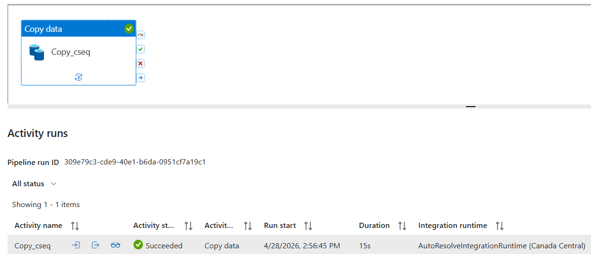
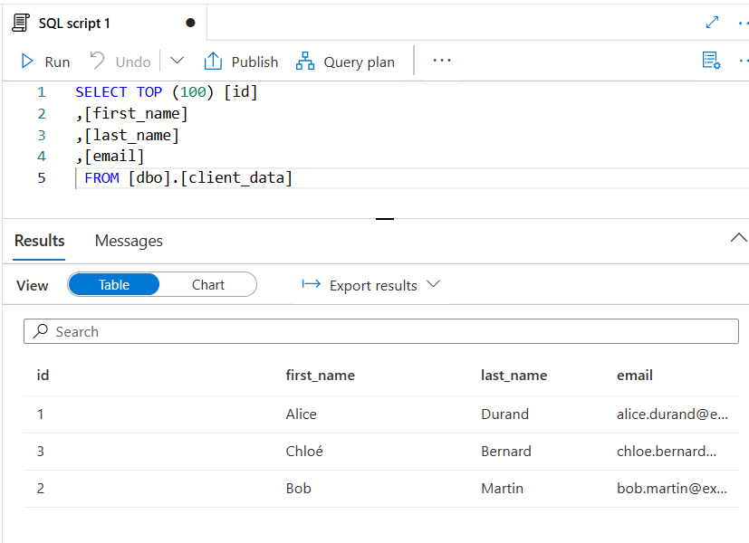

# 🏗️ Azure Data Engineering: Secure SQL-to-Synapse Pipeline

## 📖 Project Overview
This project demonstrates a production-grade ETL (Extract, Transform, Load) pipeline that migrates relational data from an **Azure SQL Database** to an **Azure Synapse Analytics Dedicated SQL Pool** using **Azure Data Factory (ADF)**.

The architecture was specifically designed for high security and performance, utilizing Azure's Managed Virtual Network environment to ensure data privacy.

---

## 🛠️ Tools & Technologies
* **Orchestration:** Azure Data Factory (ADF)
* **Destination:** Azure Synapse Analytics (Dedicated SQL Pool)
* **Source:** Azure SQL Database
* **Storage:** Azure Data Lake Storage Gen2 (used for PolyBase staging)
* **Networking:** Managed Virtual Network, Managed Private Endpoints
* **Security:** Microsoft Entra ID (Managed Identity)

---

## 🚀 Key Technical Challenges Overcome

### 1. Enterprise-Grade Security (Managed VNet)
Instead of using public endpoints, I implemented a **Managed Virtual Network** within ADF. I successfully configured and approved **Managed Private Endpoints** to create a secure "tunnel" to Synapse and SQL DB, ensuring data never touched the public internet.

### 2. Password-less Authentication (RBAC)
To follow security best practices, I moved away from SQL Authentication. I configured **System-Assigned Managed Identity** for the Data Factory, granting it `db_owner` permissions via T-SQL, enabling secure, credential-free access.

### 3. Optimized Performance (Staged Copy)
To maximize ingestion speed into Synapse, I utilized **Staged Copying**. By using an Azure Blob Storage staging area, the pipeline leverages the **Bulk Insert/Copy Command** for significantly faster throughput compared to standard row-by-row insertion.

---

## 📊 Results & Evidence

### Pipeline Execution
The pipeline successfully orchestrated the movement of data, validating the networking and authentication handshake.

### Data Verification
A SQL query within the Synapse Workspace confirms the successful migration and integrity of the client data.

---

## 📂 Repository Structure
* `/factory`: Data Factory configuration files.
* `/pipeline`: JSON definitions of the migration logic.
* `/linkedService`: Connection configurations (Managed Identity/Private Link).
* `/managedVirtualNetwork`: Definitions of the secure network environment.

---
